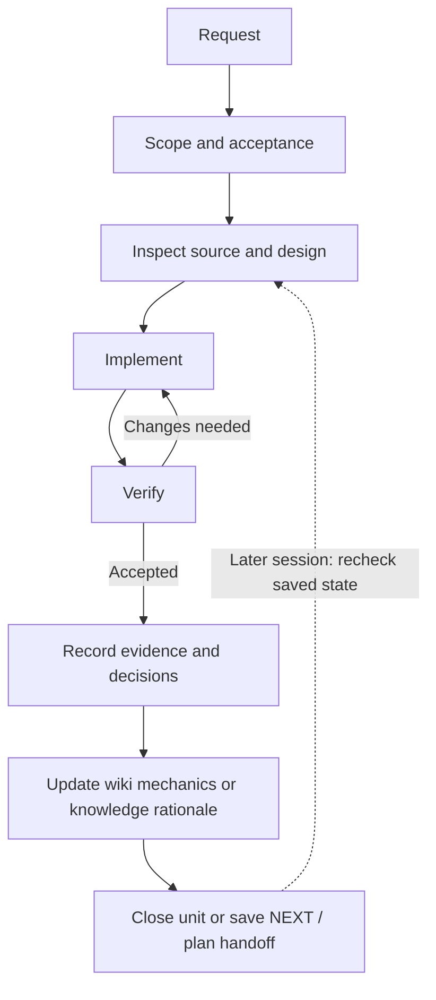

# harness_codex

`harness_codex` is a portable workflow harness for Codex on Windows and macOS. It helps a
coding session turn a request into a bounded result, verify it against the current source,
and leave enough durable state for later work.

The distribution installs user-level policy, reusable skills, native hook adapters,
health checks, and project templates through one shared Python installer. It does not
ship account data, credentials, provider configuration, SSH destinations, permissions,
or fixed model assignments.

## Why use a workflow harness?

Long-running software work often fails between the request and the next session. Scope expands,
evidence goes stale, design decisions survive only in chat, or a clean status check is mistaken
for proof that a host delivered an event. This harness gives Codex a consistent operating
contract and gives projects explicit places for current state, mechanics, and decisions.

The goal is practical continuity. A small change can stay small; a complex change can carry a
plan and evidence across sessions. Current code and observed execution remain more authoritative
than a summary written earlier.

## Operating principles

### 1. Work in bounded autonomous units

A unit has one concrete outcome, the context it needs, and explicit completion conditions.
Once authorized, Codex can investigate, implement, test, update affected documentation, and
close the unit without repeatedly asking about routine reversible choices.

For example, “fix the installer” becomes a reproduction, a scoped implementation, and
an extracted-package installation check. An unrelated refactor remains outside that
unit even when it would be convenient to include.

### 2. Define purpose and acceptance before editing

The workflow turns a vague request into behavior that can be checked. More than one
reasonable design, a public contract change, or a durable data-shape choice receives
design attention before code changes. Mechanical fixes can proceed directly.

Acceptance follows the surface being changed. Library behavior may need a focused test;
an installer needs an actual isolated installation; a packaged release needs checks
against the extracted archive.

### 3. Separate source truth from observed evidence

Source code is the reference for what the implementation does. A test log, installed
state, hook configuration, and live host behavior are separate observations with their
own scope and revision.

For example, `setup-check` can confirm installed bytes and configured hook commands. It
cannot by itself prove that the host trusted a hook, delivered an event, or exposed the
result to a model. Reports should state which layer was actually observed.

### 4. Keep changes small and attributable

Every changed line should trace to the accepted outcome. The policy favors simple code,
targeted searches, narrow patches, and the smallest meaningful verification set. It asks
agents to preserve existing work instead of resetting or broadly cleaning a working tree.

Code comments stay sparse: a short file-purpose statement is enough for most source.
Mechanics belong in the code-derived wiki, while rationale and rejected alternatives
belong in the knowledge layer.

### 5. Give durable information one clear home

Current action, broader phase state, code mechanics, and human reasoning change at different
rates. The templates keep them separate so a handoff does not become a backlog and a wiki
page does not become an unstructured decision journal.

The agent still owns the semantic work. Scripts can validate records and preserve a
written handoff, but they do not infer decisions that were never recorded.

### 6. Recover from interruptions without claiming perfect continuity

`NEXT.md`, optional plan handoffs, freshness checks, and native hooks make saved state
available after a pause or compaction. The next session rechecks that state against the
current commit and dirty files before relying on it.

This reduces context loss; it cannot guarantee zero context drift. A changed dependency
contract or working tree invalidates affected prior evidence until it is checked again.

### 7. Keep delegation optional and recipient-owned

The harness can validate and attest native role routing when the recipient configures it.
Project choices take precedence over an optional user-level default; without either, routing stays unset.

The distribution does not choose models or reasoning efforts. Delegated reports are inputs to
the parent agent, which remains responsible for source inspection, integration, and completion.

## A unit in practice

The path is iterative rather than a mandatory phase count. The agent writes durable artifacts as needed.



## What the harness includes

- **Direct-session policy.** The managed `AGENTS.md` block defines scope, autonomy,
  preservation, verification, review, and communication rules. Existing instructions
  outside that block remain under the recipient's control.
- **Reusable workflow skills.** `dev-setup` routes status, sync, hooks, doctor, skills,
  and project initialization. Focused skills cover interviews, codebase wiki work,
  knowledge capture, health checks, transcript recall, review, and scoped cleanup. See
  [SKILLS.md](SKILLS.md) for the catalog.
- **Durable project bootstrap.** `project-init` creates an `AGENTS.md` front door, one
  active `NEXT.md` handoff, workflow space, source-pinned wiki, human-facing knowledge,
  and optional project hooks. Existing projects can add only the missing knowledge
  scaffold with `scripts/init-knowledge.py`.
- **Health and evidence checks.** `project-health.py` reports lightweight NEXT freshness,
  hook drift, and doctor recency, and records a user-level liveness heartbeat when run
  normally. `doctor` performs deeper wiki, knowledge, fragment, and template checks.
  `setup-check.py` compares installed managed content and hook commands with the recorded
  source.
- **Scoped installation and recovery.** Preview-first installation manages only its
  policy block, shipped skills, hook definitions, and state. It backs up replaced managed
  paths, preserves unrelated files, and refuses unsafe linked boundaries. Rollback and
  uninstall refuse to overwrite files changed after installation.
- **Portable dependency runtime.** When the invoking Python lacks PyYAML, onboarding can
  create a repository-local `.runtime` and install requirements there without changing
  global Python packages. Later installer and status paths retain the recorded interpreter
  contract.
- **Source and release tooling.** Sync operates on a clean exact Git root and keeps its
  configured tracking source. Packaging creates an allowlisted deterministic ZIP and an
  adjacent SHA-256 file while excluding Git history, runtime state, account data, and
  private notes.

Everyday examples include running `dev-setup status` before maintenance, using
`deep-interview` to turn an ambiguous feature into an accepted spec, capturing a consequential
choice with `knowledge-fragment`, or running `doctor` before a milestone.

## Project information layers

| Layer | Purpose |
|---|---|
| `AGENTS.md` | Project-specific operating rules and cold-start routing |
| `NEXT.md` | One current unit and its next action |
| `workflow/` | Broader phase state and resumable plans |
| `wiki/` | Terse, source-pinned code mechanics and architecture |
| `knowledge/` | Decisions, experiments, comparisons, evidence, and risks |
| `knowledge/_fragments/` | Temporary per-unit deltas awaiting review and consolidation |

## Guidance and enforced safeguards

The harness combines policy with executable checks. They have different strength.

| Surface | What it provides | Boundary |
|---|---|---|
| Policy and skills | Guidance for scope, design, evidence, documentation, and review | Depends on the active agent and host following the installed instructions |
| Installer and recovery scripts | Managed-path ownership, backups, path/link checks, source snapshots, and edit-sensitive recovery | Applies only to files and state managed by this distribution |
| Setup and health checks | Current content, configuration, freshness, and runnable command probes | Does not establish host trust, event delivery, or request runtime identity |
| Handoff hooks and templates | Storage and recovery of state the agent explicitly wrote | Cannot summarize an unrecorded conversation or guarantee zero context drift |
| Native routing hooks | Validation of recipient-selected roles against a fresh catalog attestation | Does not select a model or prove the service-side identity that handled a request |

## Install

Read [START-HERE.md](START-HERE.md) for the full receiver procedure and recovery boundary.
You need Codex, Python 3.11+, Git, and Git Bash for shell-based project hooks on Windows.

Keep a Git clone or extracted ZIP in a permanent writable directory because installed
hooks refer to that source. Do not overwrite an existing destination.

```powershell
git clone https://github.com/ARCLIGHTSTRVL/harness_codex.git C:\path\to\harness_codex
cd C:\path\to\harness_codex
python scripts/onboard.py
python scripts/onboard.py --apply
python scripts/setup-check.py
```

On macOS, use the same sequence with a POSIX path and `python3`.

The first onboarding command checks prerequisites and previews targets without writing.
`--apply` installs for the current user into `CODEX_HOME`, or `~/.codex` by default.

On Windows, standard CPython and MSYS2 UCRT64/MINGW64 native Python are supported;
MSYS `/usr/bin/python` is POSIX and cannot run the native Windows hook contract.

After installation, review changed hook definitions in the host hook UI (`/hooks` where supported)
and reopen the session if needed. Check installation, trust, and observed hook delivery separately.

## Update and recovery

For a clean Git clone, run `scripts/sync.ps1` on Windows or `bash scripts/sync.sh` on
macOS, then run `setup-check.py`. Sync requires the source directory to be the exact Git
root, refuses a dirty tree, and uses its existing tracking branch. A ZIP has no update
history; clone the public repository into a new permanent directory instead.

Recovery is preview-first:

```text
python scripts/install.py rollback --home USER_HOME --repo THIS_FOLDER --platform windows
```

Use `mac` on macOS, add `--apply` after reviewing the plan, or replace `rollback` with
`uninstall` to restore the recorded baseline. Recovery refuses changed targets and has
no force-overwrite mode. See [START-HERE.md](START-HERE.md) for version-by-version and
preserved-source details.

## Documentation

- [START-HERE.md](START-HERE.md) — receiver installation and recovery procedure
- [SKILLS.md](SKILLS.md) — installed skill catalog
- [BOOTSTRAP.md](BOOTSTRAP.md) — project bootstrap overview
- [docs/KNOWLEDGE-WORKFLOW.md](docs/KNOWLEDGE-WORKFLOW.md) — knowledge lifecycle
- [docs/NATIVE_AGENT_CONTRACT.md](docs/NATIVE_AGENT_CONTRACT.md) — optional role routing
- [docs/PACKAGING.md](docs/PACKAGING.md) — distribution boundary and measured validation
- [NOTICE.md](NOTICE.md) — attribution and current license status

## Maintainer checks

```text
python scripts/lint.py
python -m unittest discover -s tests
python scripts/package.py
```

Packaging writes the versioned ZIP and SHA-256 sidecar under `dist/`. Release evidence is
revision-specific; rebuild and recheck the archive after documentation changes.
